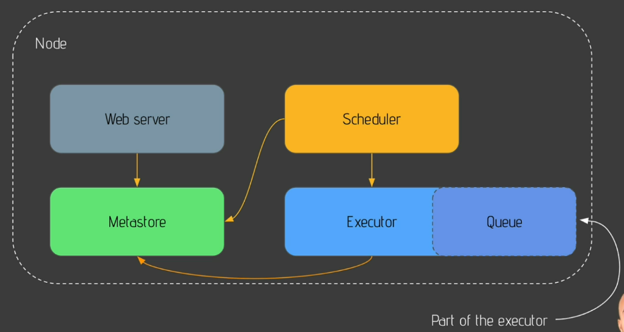
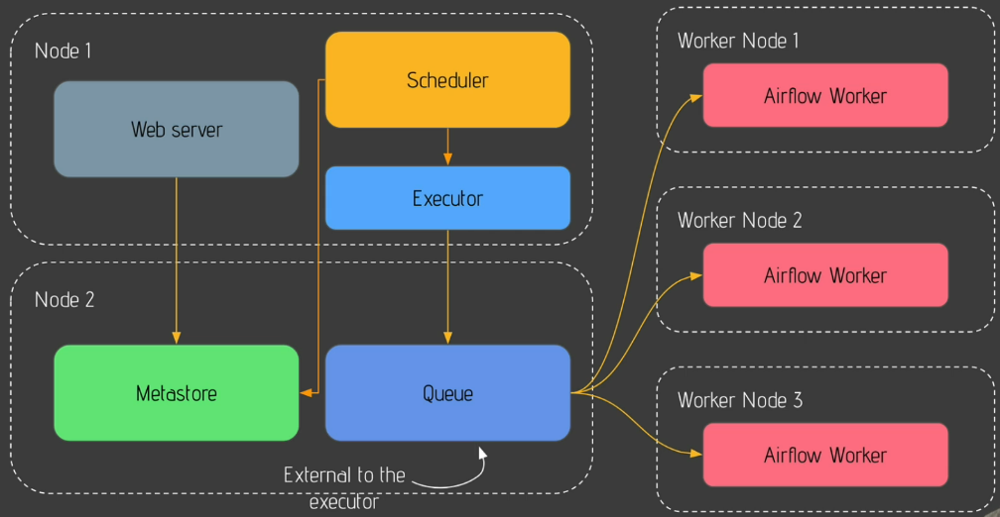

# Introducción

> Airflow is a platform to programmatically author, schedule and monitor workflows.

Airflow es un conjunto de herramientas que sirven de orquestador para
controlar, administrar y monitorear diferentes procesos de datos (data pipelines).
Sus principales ventajas son que permite crear pipelines de datos de una forma
dinámica usando el lenguaje python, escala bien con la cantidad de pipelines
y número de tareas concurrentes que debe ejecutar cada pipeline.
Tiene una interfaz de línea de comando (CLI) que permite administrar y controlar
de una manera granular todos los componentes de la plataforma, pero también
tiene una interfaz WEB para manejar los pipelines de una forma más amigable.
Por último airflow permite crear extensiones para aumentar la funcionalidad
de la plataforma.

## Conceptos básicos de airflow

### Componentes principales de la plataforma
- Servidor web: Es la interfaz web que permite administrar los pipelines
- Scheduler: Es el encargado de calendarizar las tareas de los pipelines
- Metastore: Almacena metadatos acerca de los pipelines, mediante el cual se comunican los otros componentes
- Executor: Clase que define el cómo se ejecutan las tareas
- Worker: Es una instancia de un proceso ejecutando alguna de las tareas

### DAG
En airflow se usa el concepto de DAG (Directed Aciclyc Graph o Grafo Dirigido Acíclico),
el cual es una representación de un pipeline, donde cada nodo es una tarea a ser
ejecutada. Si hay una arista que va de un nodo $v$ a un nodo $u$, entonces la
tarea en el nodo $u$ depende de la ejecución de la tarea en el nodo $v$.

### Operators
Es otra forma de llamarle a las tareas (Tasks) que se deben realizar en un pipeline.
Hay tres tipos de operadores:
- Action operators: representan acciones, tales como ejecutar un comando de bash o python
- Transfer operators: representan movimientos de datos entre distintas fuentes, tales como transferir datos de una base de datos a otra
- Sensor operators: se usan para detectar que se cumplió una acción, por ejemplo la finalización de una transferencia de datos o la finalización de un comando

### En qué situaciones no usar Airflow
Si se quiere obtener datos en tiempo real de alguna fuente, airflow no es 
la herramienta adecuada para esto. En este caso se debería usar otra
herramienta. Tampoco sirve como framework de proceso de datos.

En ambos casos sucede lo mismo, se puden usar herramientas especializadas
para resolver el problema, pero usar operadores de airflow para ejecutar
esas herramientas y verlas como un Task.

## Tipos de arquitecturas
El funcionamiento interno de Airflow se puede explicar a partir de
dos tipos de arquitecturas distintas, la **single node** y la 
**multi nodes** (o Celery).

### Single node architecture

Esta arquitectura es buena para hacer pruebas o para ejecutar pocos
pipelines. Todos los componentes de airflow residen y se ejecutan en
el mismo dispositivo.

Como ya vimos, el metastore almacena toda la información relacionada
para que funcionen todos los demás componentes. El scheduler en cuanto
se da cuenta de que una tarea debe comenzar, le avisa al metastore
que cambie el estado de dicha tarea a "ejecutando". La interfaz web
puede ir mostrando y actualizando el estado de las tareas según los
cambios que haya en el metastore. El executor comienza a ejecutar las
tareas, y con ayuda de un queue va definiendo el orden en que se ejecutan
las mismas. Cuando el executor finaliza alguna tarea, este actualiza el
estado en el metastore.

### Multi nodes (Celery)

Es una arquitectura en la que se pueden ejecutar una gran cantidad de
tareas, incluso de forma concurrente. Los componentes residen y se 
ejecutan en dispositivos separados. Se compone de dos dispositivos
principales y muchos secundarios.

En el primer nodo (o dispositivo) está la interfaz web, el scheduler
y el executor. En el segundo nodo principal está el metastore y
el queue, mientras que en todos los demás nodos secundarios se encuentran
en cada uno un Worker ejecutando tareas. A estos nodos secundarios
también se les llama **worker nodes**.

El funcionamiento es similar al de la arquitectura single node, pero
la diferencia es que los workers van a ser los que estén pendientes
al queue para ejecutar tareas.
