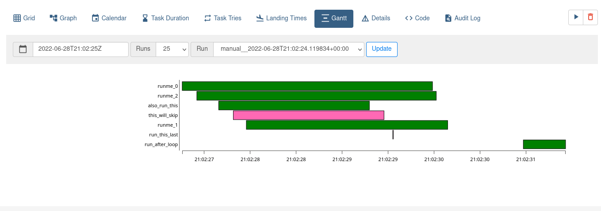

# Interfáz gráfica web
Airflow cuenta con una interfáz web en la cuál se pueden monitorear y
administrar de una forma más sencilla los DAGs, crear conexiónes,
crear administradores, etc. En esta guía solo se cubren las secciones
de administración y monitoreo de DAGs.

## Inicio de sesión
Una vez iniciado el webserver podemos acceder a la interfaz web desde
[localhost:8080](http://localhost:8080)

Desde esta ventana se inicia sesión al sistema, por defecto se usa
el usuario `airflow` y contraseña `airflow`:

## Lista de DAGs
Al iniciar sesión nos manda directamente a la lista de DAGs, en ella
podemos ver todos los DAGs que vienen como ejemplo en airflow y 
los DAGs que hemos creado:

Cada columna de la lista de DAGs son lo siguiente (de izquierda a 
derecha):
- Un botón toggle para activar o desactivar el DAG
- El nombre o identificador único del DAG
- Abajo del id tenemos los tags asociados a ese DAG
- El usuario dueño del DAG
- Los estados de las ejecuciones actuales y pasadas de DAG
- Cada cuándo se ejecuta el DAG
- La fecha de la **última** ejecución del DAG
- La fecha de la **siguiente** ejecución del DAG
- El estado de las tasks dentro del DAG
- Acciones como ejecutar o eliminar el DAG

## Vista Grid
Se pueden acceder a los detalles de un DAG dando click en su identificador único:

Esto nos lleva a la vista **Grid**, en la cuál tenemos una visualización
de todas las ejecuciones de este DAG. Tenemos estadísticas como la duración
del DAG y estado de cada task dentro del DAG.

Si clickamos en un Task, ahora cambia a detalles de esa ejecución de ese
Task. Desde esta vista podemos acceder a los **logs** del task o a los datos
que almacena usando XComs:

## Vista Graph
Para tener una vista del DAG en forma de grafo hay que acceder
a la pestaña Graph. Ayuda a entender las dependencias entre Tasks
dentro del data pipeline:

Los colores en los bordes de cada Task significan un estado diferente
del Task, por ejemplo en verde claro es que se está ejecutando, pero
en verde fuerte es que ya terminó la ejecución, rojo es fallido.
Además el color dentro del task es el tipo de Operador:

Al igual que la vista Grid, se puede acceder a los detalles del
Task si se da click sobre él.

## Vista Landing
En esta vista podemos ver los tiempos que toma cada tas a lo largo
de múltiples ejecuciones del DAG. Es útil para verificar el tiempo
que toma de una ejecución a otra (tal vez por que ese día se 
procesaron más datos o porque los servicios eran más lentos):

## Vista Calendar
En esta vista podemos ver cuándo se ejecutará el DAG así como
el estado que resultó en ejecuciones pasadas del DAG. Con esto
podemos monitorear, por ejemplo, qué días ha estado fallando la ejecución.

## Vista Gantt
Nos da una vista del tiempo que toma cada task dentro del
DAG, cuánto más largo es un rectángulo, más tiempo le tomó al task
completarse. Además si hay rectangulos encimados, significan ejecuciones
concurrentes de Tasks. Con esta vista podemos identificar cuellos de botella.

