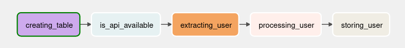
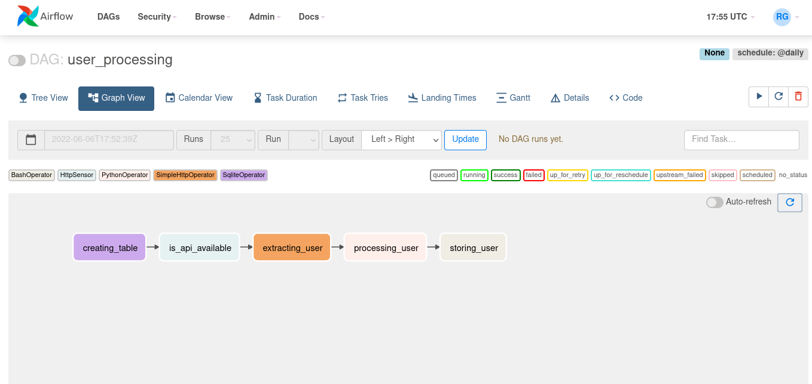

# Creación de un DAG introductorio

## Introducción
En esta sección del manual se va a crear un DAG muy sencillo para ejemplificar y presentar
las principales funcionalidades de Airflow.

El data pipeline que se va a seguir es el siguiente:



La primera tarea a realizar es la creación de la base de datos donde vamos a guardar nuestros usuarios.
Lo siguiente será verficar que la api que se está consultado esté disponible.
Luego se hará una petición a la api para obtener los datos de algún usuario.
Los datos obtenidos en el paso anterior serán procesados para adaptarlos a nuestra base de datos.
Finalmente se guardará el usuario procesado en la base.

## Esqueleto básico de DAG
Crear un directorio `dags` en el directorio `airflow` que se creó cuando se ejecutó `airflow db init`

Crear un archivo `user_processing.py` en el directorio `dags`. Este archivo definirá el DAG que vamos
a crear más adelante.

Para comenzar definimos el esqueleto básico del DAG:
```python
from airflow.models import DAG

from datetime import datetime

# Parámetros comúnes a todas las tasks del DAG
default_args = {
    "start_date" = datetime(2020,1,1) # Todas las tareas comienza a agendarse a partir de start_date
}

# Definición del DAG
with DAG("user_processing", # dag_id
        schedule_interval="@dayli", # Cada cuánto se va a ejecutar
        default_args=default_args,
        catchup=False # Lo veremos al final de esta guía
	) as dag:
    # Definir Tasks/Operators
    pass
```

### Operators
Operators son lo mismo que un Task o un nodo en el DAG.

Lo ideal es separar cada Task en un operador distinto para poder reintentarlas
sin ejecutar el proceso completo solo la tarea fallida.

Hay 3 tipos de operadores:
- Acción: para **ejecutar** comandos de bash o funciones de python
- Transacción: para **realizar trasnferencia** de datos, por ejemplo entre bases de datos
- Sensor: para **verificar** condiciones

## Primer Task: Create table
El objetivo del primer task es crear una tabla en nuestra base de datos, con la estructura
que necesitamos para guardar los usuarios.

El operador `SqliteOperator` permite ejecutar sentencias SQL sobre una conexión de bases de datos.
Este es un ejemplo de operador de transferencia.
```python
...

from airflow.providers.sqlite.operators.sqlite import SqliteOperator # Operator para usar una base SQLite

...

with DAG(params...) as dag:
    # Primer Task: crear la base de datos
    creating_table = SqliteOperator(
        task_id="creating_table", # Todas las tasks dentro de un mismo DAG deben tener un id distinto
        sqlite_conn_id="db_sqlite", # La conexión para conectarse a la DB, se define dentro de airflow
        sql='''
            CREATE TABLE users (
                email TEXT NOT NULL PRIMARY KEY,
                first_name TEXT NOT NULL,
                last_name TEXT NOT NULL,
                age INTEGER NOT NULL,
                country TEXT NOT NULL,
                user_name TEXT NOT NULL,
                password TEXT NOT NULL
            );
        ''' # Consulta a ejecutar en la base de datos
    )
```

### Providers
Al ser Airflow un orquestador, este puede trabajar con diferentes tecnologías,
por lo cuál se crean paquetes individuales para cada una de estas tecnologías.

A este tipo de paquetes se les llama **providers**. Estos no vienen instalados
por defecto junto con airflow, por lo cuál si se quiere usar airflow junto a
una tecnología en específico primero se tiene que instalar el paquete correspondiente.

Aquí se puede encontrar una 
[lista](https://airflow.apache.org/docs/#providers-packages-docs-apache-airflow-providers-index-html)
con todos los providers disponibles.

Para instalar el provider: `pip install apache-airflow-providers-[package]`

Para verificar los ya instalados `airflow providers list`

### Creación de conexión
Vamos a usar SQLite para la base de datos, por lo cuál necesitamos tener instalado
el paquete `apache-airflow-providers-sqlite`.

Una vez instalado vamos a crear la conexión a la base de datos desde la interfaz web:

1. Accedemos al administrador de conexiones:


2. Seleccionamos nueva conexión:


3. Llenamos los campos adecuados:


> Nota: Podría requerir reiniciar el servidor luego de instalar un nuevo provider

### Testear un Task
Se pueden ejecutar tasks individuales para verificar que funcionen sin necesidad de
ejecutar todo el data pipeline.

El comando es el siguiente: `airflow tasks test [dag_id] [task_id] [date]`

En nuestro caso podemos ejecutar: `airflow tasks test user_processing creating_table 2022-01-01`

Para verificar que se haya creado la tabla podemos usar SQLite:
```bash
$ sqlite /home/airflow/airflow/airflow.db
> SELECT * FROM users;
> .quit
```

## Segundo Task
Instalación de provider HTTP

El sensor `HttpSensor` permite verificar la disponibilidad de algún servidor http.
```python
from airflow.providers.http.sensors.http import HttpSensor # Sensor para verificar disponibilidad de api

with DAG(params...) as dag:
    # Primer Task: crear la base de datos
	...

	# Task para verificar que la api esté disponible
    is_api_available = HttpSensor(
        task_id="is_api_available", # id del task dentro del dag
        http_conn_id="user_api", # Conexión que se usará para hacer la petición HTTP
        endpoint="api/" # Endpoint sobre el que se desea saber su disponibilidad
    )
```

Creación de la conexión HTTP

Testear task

## Tercer Task
Obtención de datos de la api

El operador `SimpleHttpOperator` permite hacer peticiones http a algún servidor.
```python
from airflow.providers.http.operators.http import SimpleHttpOperator
import json

with DAG(params...) as dag:
    # Primer Task: crear la base de datos
	...

	# Task para verificar que la api esté disponible
	...

	# Task para obtención de datos de la api
    extracting_user = SimpleHttpOperator(
        task_id="extracting_user",
        http_conn_id="user_api",
        endpoint="api/",
        method="GET", #Método http a usar en la petición
        response_filter=lambda res: json.loads(res.text), #pequeño preprocesamiento que se le hace a los datos
        log_response=True # La respuesta de la petición se guarda en los logs
    )
```

Testear el task `airflow tasks test user_processing extracting_user 2022-01-01`

## Cuarto task

Procesamiento de datos

El operador `PythonOperator` permite ejecutar funciones/rutinas de python.
```python
from airflow.operators.python import PythonOperator
from pandas import json_normalize

def _processing_user(task_instance):
    """Preprocesamiento del usuario, ajusta la respuesta a nuestro esquema
    en la base de datos y lo almacena como un CSV

    Parameters:
    -----------
    task_instance: instancia del task que ejecuta la función

    Raises:
    -------
    ValueError: si no recibió datos de usuario
    """
    users = task_instance.xcom_pull(task_ids=["extracting_user"]) #Extraemos la respuesta del task anterior por medio del xcom
    if not len(users) or "results" not in users[0]:
        raise ValueError("User is empty")
    user = users[0]["results"][0]
    processed_user = json_normalize({
        "email": user["email"],
        "first_name": user["name"]["first"],
        "last_name": user["name"]["last"],
        "age": user["registered"]["age"],
        "country": user["location"]["country"],
        "user_name": user["login"]["username"],
        "password": user["login"]["password"]
    })
    processed_user.to_csv("/tmp/processed_user.csv", header=False, index=False) #Guardamos los datos como un CSV para el siguiente paso

with DAG(params...) as dag:
    # Primer Task: crear la base de datos
	...

	# Task para verificar que la api esté disponible
	...

	# Task para obtención de datos de la api

	# Task de procesamiento de datos
    processing_user = PythonOperator(
        task_id="processing_user",
        python_callable=_processing_user # Función de python a ejecutar
    )
```

Testear el task con `airflow tasks test user_processing processing_user 2022-01-01`

### XCOM
Para poder comunicar el task de obtención de datos y el task de procesamiento,
se usa el **XCOM**, es una base de datos donde se pueden ir guardando en el metastore
las salidas de los tasks.

## Quinto task

Almacenamiento del csv en la base de datos

El operador `BashOperator` permite ejecutar comando de bash.
```python
from airflow.operators.bash import BashOperator

...

with DAG(params...) as dag:
    # Primer Task: crear la base de datos
	...

	# Task para verificar que la api esté disponible
	...

	# Task para obtención de datos de la api
	...

	# Task de procesamiento de datos
	...

	# Task de almacenamiento de usuario
    storing_user = BashOperator(
        task_id="storing_user",
        bash_command="""echo -e ".separator ","\n.import /tmp/processed_user.csv users" | sqlite3 /home/airflow/airflow/airflow.db""" 
		# el comando a ejecutar en bash
    )
```
Testear con: `airflow tasks test user_processing storing_user 2022-01-01`

## Dependencias entre Tasks
Una vez que se tienen las tasks creadas, se tiene que definir cuál depende
de otra, para ello se usa el operador de recorrimiento a la derecha:
```python
...

with DAG(params...) as dag:
    # Primer Task: crear la base de datos
	...

	# Task para verificar que la api esté disponible
	...

	# Task para obtención de datos de la api
	...

	# Task de procesamiento de datos
	...

	# Task de almacenamiento de usuario
	...

	# El operador de recorrimiento a la derecha define las dependencias entre Tasks
    creating_table >> is_api_available >> extracting_user >> processing_user >> storing_user
```
Todos los cambios reflejados en la interfaz web


## Ejecutando el data pipeline

Para echar a andar el pipeline lo activamos:


En este caso va a fallar el primer task porque la base de datos ya existía al
momento de testear:


Verificamos el log para confirmar cuál fue el fallo:


Hay que asegurarse que las sentencias SQL se puedan ejecutar más de una vez.
En el caso de creación de tablase se usa `IF NOT EXISTS`, así que lo corregimos:
```python
...

with DAG(params...) as dag:
    # Primer Task: crear la base de datos
    creating_table = SqliteOperator(
		...
        sql='''
            CREATE TABLE IF NOT EXISTS users (
			...
            );
        '''
    )
```

Una vez corregido reiniciamos el task:


## Intervalos de tiempo
Algo a tener siempre presente es que cuando se calendariza un DAG y se le asigna un
intervalo de tiempo, la primera ejecución del DAG será la fecha de inicio + el 
intervalo asignado.

Por ejemplo si un DAG tiene `start_date = 2022-01-01 10am` y un `schedule_interval=10mins`,
entonces la primera ejecución será el 2022-01-01 a las 10:10am.

## Catchup
El parámetro `catchup` (que se definió al inicio en el esqueleto del DAG), sirve para
ejecutar todas las DAG Runs de dicho DAG desde la última vez que se pausó el DAG.

## Zona horaria
Por defecto todas las horas y fechas que se manejan en Airflow son en formato UTC.
De ser requerido se puede modificar las variables `default_ui_timezone` y `default_timezone`
en el archivo de configuración `ariflow.cfg`. Lo recomendable y como buena practica es dejarlo
en UTC.
