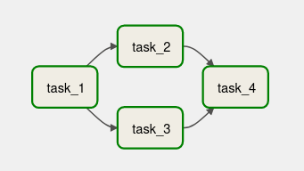

# Agrupamiento de tasks

Airflow nos da la posibilidad de agrupar tasks repetitivas
y verlas como una sola tarea. De este modo podemos tener
DAGs más limpios.

## SubDAGs
Un subdag nos permite tener una DAG dentro de otro. 
El subdag se va a ver como una tarea.

Como ejemplo vamos a usar el DAG `parallel_dag`, que tiene dos
tasks que se ejecutan de forma paralela (dependiendo del Executor).
```python
from airflow.models import DAG
from airflow.operators.bash import BashOperator

from datetime import datetime

default_args = {
    "start_date": datetime(2022, 1, 1)
}

with DAG("parallel_dag",
        schedule_interval="@daily",
        default_args=default_args,
        catchup=False) as dag:
    
    task_1 = BashOperator(
        task_id="task_1",
        bash_command="sleep 3")

    task_2 = BashOperator(
        task_id="task_2",
        bash_command="sleep 3")

    task_3 = BashOperator(
        task_id="task_3",
        bash_command="sleep 3")

    task_4 = BashOperator(
        task_id="task_4",
        bash_command="sleep 3")

    task_1 >> [task_2, task_3] >> task_4
```

El DAG se ve así:



Vamos a agrupar el task2 y task3 para verlos como una sola tarea.
Para ello usaremos el operador SubDagOperator:
```python
...
from airflow.operators.subdag import SubDagOperator

from subdags.subdag_parallel_dag import subdag_parallel_dag #Este archivo se creará más adelante

...
with DAG(...) as dag:
    
    task_1 = BashOperator(...)

	# Creamos el subdag
	processing = SubDagOperator(
		task_id="processing", #al igual que las otras tasks debe tener un id
		subdag=subdag_parallel_dag(...) #llamamos la función que genera el subdag (esta función la vamos a generar en el siguiente paso
	)

    task_2 = BashOperator(...)

    task_3 = BashOperator(...)

    task_4 = BashOperator(...)

	task_1 >> [task_2, task_3] >> task_4
```

Para crear el subdag primero vamos a crear una carpeta en la ruta `airflow/dags/subdags`.
Y en esa carpeta creamos un archivo llamado `sugdag_parallel_dag.py` donde pondremos
la función que genera el subdag.

```python
from airflow import DAG
from airflow.operators.bash import BashOperator

def subdag_parallel_dag(parent_dag_id, child_dag_id, default_args):
    """Genera el subdag
    Parameters:
    -----------
    parent_dag_id: El id del DAG al que pertenece
    child_dag_id: El id que se le asignó al subdag
    default_args: Los parámetros del DAG al que pertenece
    """
    with DAG(dag_id=f"{parent_dag_id}.{child_dag_id}", # Su id debe tener este formato
            default_args=default_args) as dag:
        # Ponemos las tasks que queremos agrupar
        task_2 = BashOperator(
        task_id="task_2",
        bash_command="sleep 3")

        task_3 = BashOperator(
            task_id="task_3",
            bash_command="sleep 3")

        # Devolvemos el subdag
        return dag
```

Volviendo al archivo `parallel_dag.py`, tenemos que quitar las tasks que
agrupamos en el subdag y definir de nuevo el orden de las tasks:
```python
...
with DAG(...) as dag:
    
    task_1 = BashOperator(...)

	# Creamos el subdag
	processing = SubDagOperator(
		task_id="processing", #al igual que las otras tasks debe tener un id
		subdag=subdag_parallel_dag('parallel_dag', 'processing', default_args)
	)

    task_4 = BashOperator(...)

	task_1 >> processing >> task_4
```

El DAG desde la interfaz web ahora tiene un solo task en vez de dos:


> Para ver los task2 y task3 se da click en subdag y luego en _Zoom into subdag_.

### Desventajas
Aunque los subDAGs son útiles, se recomienda no usarlos en producción porque:
- pueden ocasionar **deadlocks**
- requieren de la creación de subcarpetas, pasar parámetros y ids desde el padre
- usan por defecto el `SequentialExecutor` incluso aunque tengamos otro en la configuración

## TaskGroups
Es una forma de agrupar tasks, como con los subDAGs,
pero mucho más sencillo y sin los problemas que estos presentaban.

Las partes a modificar en el código son muy pocas:
```python
...
from airflow.utils.task_group import TaskGroup # La importamos para crear el grupo

# Ya no necesitamos importar de archivos externos
#from subdags.subdag_parallel_dag import subdag_parallel_dag

...

with DAG(...) as dag:
    
    task_1 = BashOperator(...)

	# Con pocos parámetros ya se crea el grupo (no necesitamos de ids ni defaults_arguments)
    with TaskGroup("processing_tasks") as processing_tasks:
		# Agregamos las tasks a ejecutar
        task_2 = BashOperator(...)

        task_3 = BashOperator(...)

    task_4 = BashOperator(...)

    task_1 >> processing_tasks >> task_4
```

Desde la interfaz web se ve igual que en un subDAG pero al desplegar 
se ve más sencillo:

 

### TaskGroups anidados
Los TaskGroups son tan flexibles, que incluso se pueden anidar:
```python
...

with DAG(...) as dag:
    
    task_1 = BashOperator(...)

    with TaskGroup("processing_tasks") as processing_tasks:
        task_2 = BashOperator(task_id="task_2", ...)

		# Creamos los TaskGroups dentro del TaskGrup anterior
		with TaskGroup("spark_tasks") as spark_tasks:
        	task_3 = BashOperator(task_id="task_3", ...) 

		with TaskGroup("flink_tasks") as flink_tasks:
        	task_3 = BashOperator(task_id="task_3", ...) #Tiene el mismo id pero no hay problema

    task_4 = BashOperator(...)

    task_1 >> processing_tasks >> task_4
```

Los ids de los tasks que están contenidos en cualquier TaksGroup, no
es necesario que sean únicos en todo el DAG, ya que se le asigna el id
del grupo al que pertenece seguido de el id que le pusimos.

En el código anterior podemos ver eso en el grupo de `spark_tasks` y en
el de `flink_tasks`, el id del task3 en `spark_tasks` sería: `processing_taks.spark_tasks.task_3`
que lo hace diferente al de `flink_tasks`: `processing_taks.flink_tasks.task_3`.


