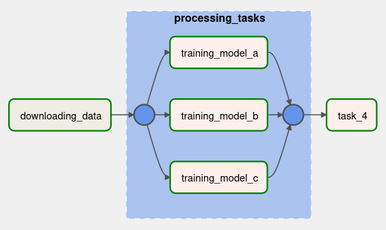

# XComs
Significa Cross Comunication y sirve para intercambiar
cantidades pequeñas de datos entre tasks. Es una estructura
de datos con forma de diccionario, es decir clave:valor.
Está almacenada en el metastore, así que hay que tener 
cuidado con el tamaño de los datos que se almacenan.

El tamaño máximo de cada xcom depende de la base de datos:
- SQLite: 2GB max
- Postgres: 1GB max
- MySQL: 64KB max

## Caso de ejemplo
Se usará como ejemplo el archivo [`xcom_dag.py`](./xcom_dag.py),
en este archivo se define un DAG con la siguiente estructura:



Simula una descarga de datos al inicio (es solo un sleep), luego
tiene un grupo de tasks que simulan el entrenamiento de tres modelos
de ML que obtienen una métrica del desempeño de cada modelo (_accuracy_),
y finalmente (task4) se elige el modelo con el mejor desempeño.

Para poder decir cuál fue el mejor modelo tenemos que tener acceso
desde task4 a las métricas de las tasks de entrenamiento.

## Funcionamiento de XComs
Los tasks pueden agregar información al XComs para comunicarse
con otros tasks. Cada que un task finaliza, va a almacenar el
valor de retorno en el XCom.

Por ejemplo para las tasks de los modelos, se llama la función
`_training_model`, si desde esta función devolvemos algo entonces
se va a guardar en el XCom:
```python
def _training_model(task_instance):
    accuracy = uniform(0.1, 10.0)
    print(f'model\'s accuracy: {accuracy}')
    return accuracy
```

Para visualizar los datos almacenados en XComs se puede acceder desde
la interfaz web en en menú de Admin/XComs.


En el listado de XComs tenemos:
- La llave con la que se identifica cada dato
- El valor de cada dato
- La fecha en que se guardó
- La fecha de ejecución del task que lo generó
- El id del task que lo generó
- Y el id del DAG al que pertenece el task


Si el dato se agregó retornando un dato desde el task, entonces
se le asigna por defecto la llave `return_value`, pero podemos
hacer que tenga otra llave si se requiere:
```python
def _training_model(task_instance):
    accuracy = uniform(0.1, 10.0)
    print(f'model\'s accuracy: {accuracy}')
    task_instance.xcom_push(key="model_accuracy", value=accuracy)

    #return accuracy # Ya no necesitamos regresar nada
```

La función debe aceptar un parámetro llamado `task_instance`, y desde
él se pueden añadir datos a los XComs. Lo mismo pasa si se quiere
acceder a los datos almacenados.
Por ejemplo para acceder al dato `model_accuracy` desde el task4:
```python
def _choose_best_model(task_instance):
    print('choose best model')
    accuracies = task_instance.xcom_pull(key="model_accuracy", task_ids=[
        "processing_tasks.training_model_a",
        "processing_tasks.training_model_b",
        "processing_tasks.training_model_c"
    ])
    print(accuracies)
```

En el método `xcom_pull`, el parámetro `key` es el nombre del dato
al que se va a acceder, y `task_ids` es la lista de los tasks que
almacenaron esos datos.
